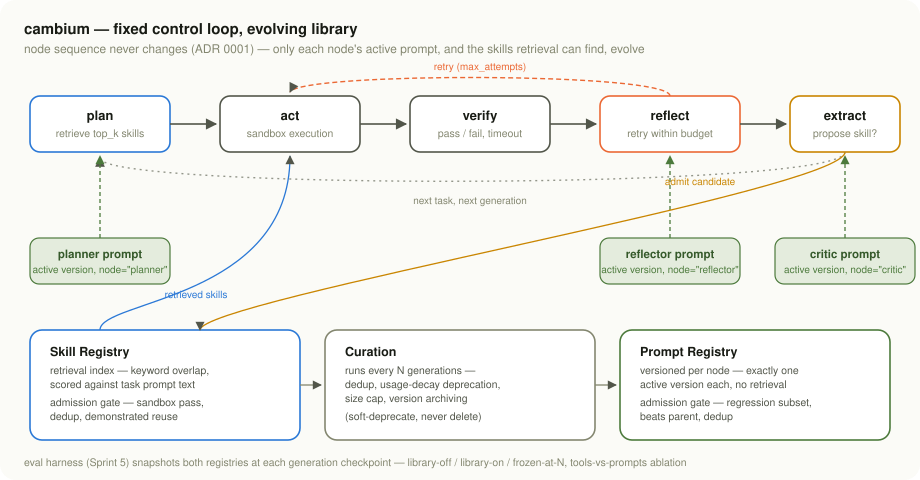

<div align="center">

# cambium

**A self-evolving agent whose tool/skill library and prompt library are the
artifacts under study** — admission-gated, retrieved, curated, and
evaluated against held-out tasks.


[](https://github.com/debarshi29/cambium/actions/workflows/ci.yml)
[](./LICENSE)

</div>

> **Thesis.** A skill and prompt library only improves an agent if
> admission is gated on verified reuse, retrieval is measured
> independently, and the library is curated. Ungated growth degrades
> performance — for tools and for prompts alike.
>
> — [`CLAUDE.md`](./CLAUDE.md) §1, the full project spec

---

## Contents

- [Read this first](#read-this-first)
- [Results](#results)
- [Quickstart](#quickstart)
- [Live LLM path](#live-llm-path)
- [Architecture](#architecture)
- [Design docs (HLD / LLD)](#design-docs-hld--lld)
- [Design decisions (ADRs)](#design-decisions-adrs)
- [Project history](#project-history)

---

## Read this first

This is a **scaled-down demo run**, built in one continuous session with no
live LLM access — not the full ~60-task, months-long research program
`CLAUDE.md` specifies. Three things to know before trusting any number
below:

| | |
|---|---|
| 🤖 **The curves below are a scripted agent, not a live model.** | The three curves and the attribution ablation measure the library harness — admission gates, retrieval, curation, evaluation — operating on a deterministic generator, not an LLM's code-generation ability. A live path *does* exist ([ADR 0007](docs/adr/0007-live-llm-integration.md)) but is kept out of the reported curves on purpose (determinism, cost, reproducibility). → [ADR 0002](docs/adr/0002-agent-stand-in.md) |
| 📦 **60 tasks, at spec size — but still small-n.** | 40 train / 20 held-out across 20 categories, as CLAUDE.md §4 specifies. Read every percentage as "N of 20 held-out," not as a statistically powered result. → [ADR 0010](docs/adr/0010-full-task-pack.md) |
| 🔒 **Subprocess isolation, not containers.** | Candidate code runs in a scrubbed-environment child process with a hard timeout — real isolation, but not the container tier `CLAUDE.md` prefers. → [ADR 0004](docs/adr/0004-sandbox-tier.md) |

[**ADR 0006**](docs/adr/0006-sprint-6-wrapup.md) is the honest scorecard:
what shipped, what didn't, and exactly what the results do and don't
support.

---

## Results

**[→ Interactive results dashboard](https://claude.ai/code/artifact/bcd4a571-b7e1-4f6a-a0da-89590c3c3edf)** — the
same numbers below as a hoverable trajectory chart, a final-state
comparison, and the reward-hacking audit, in one page.

### The three curves + attribution ablation

`CLAUDE.md` §4, measured on the 20-task held-out set:

| curve | held-out solved |
|---|---:|
| **library-off** — fixed toolset, fixed prompts | 3/20 &nbsp;(15%) |
| **library-on, evolving** — generation 4 | **20/20 (100%)** |
| **frozen at generation 2**, evaluated onward | 19/20 &nbsp;(95%) |
| tools-only ablation — skills evolve, prompts fixed | 3/20 &nbsp;(15%) |
| prompts-only ablation — prompts evolve, skills fixed | 3/20 &nbsp;(15%) |

### Generation-by-generation trajectory

The live "both evolving" run:

| generation | train | held-out | active skills | recall@1 | recall@top_k |
|---|---:|---:|---:|---:|---:|
| 1 — default prompts | 7/40 | 3/20 | 0 | — | — |
| 2 — reflector retry budget raised | 40/40 | 19/20 | 17 | 94% | 94% (k=1) |
| 3 — planner top_k raised | 40/40 | **20/20** | 17 | 94% | **100%** (k=2) |
| 4 | 40/40 | 20/20 | 17 | 94% | 100% (k=2) |

### The headline finding

Tools-only and prompts-only **each independently land exactly at the
library-off floor** (3/20) — not partway between library-off and
library-on. Only both evolving together reach 20/20. That's a genuine
interaction effect measured by the actual gate/generation/eval mechanics,
not curve-fit after the fact:

- **Tools-only** never admits a single skill: the reflector's retry budget
  never gets raised (prompts are fixed), so every flawed-first generation
  candidate fails on attempt one with no retry available.
- **Prompts-only** reaches **40/40 on train** — the reflector's raised
  retry budget lets fresh generation solve every category, every time —
  but held-out stays at 3/20, because held-out is scored on retrieval +
  base capability only, never on fresh generation (see
  [ADR 0005](docs/adr/0005-eval-only-scoring.md)). Task-solving capability
  that isn't *persisted as an admitted skill* doesn't transfer. This is
  the single most direct piece of evidence in this repo for the project's
  thesis.
- **Frozen-at-2 (19/20) is strictly worse than live-at-3+ (20/20).** A real,
  measured retrieval collision — two skills' docstrings tie on a shared
  token, and alphabetical order picks the wrong one for `primality` tasks
  (found empirically while testing, not staged — see
  `tests/test_recall.py`) — costs one held-out task until the planner's
  `top_k` gets admitted at generation 3. Continued evolution past a freeze
  point measurably helps.

### Reward-hacking audit

An overfit skill candidate for `run_length_encoding` — hardcodes its
origin task's exact outputs, wired into
[`cambium.agent.generation`](src/cambium/agent/generation.py) specifically
to test this — is proposed twice and **rejected both times** by the
admission gate's reuse check, before a general fix gets admitted from the
category's second task instead. Full findings live in
`results/eval_report.json` under `hacking_audit`, reproduced by
[`cambium.eval.hacking_audit`](src/cambium/eval/hacking_audit.py) on every
eval run — reporting this is a feature of the project, not a suppressed
embarrassment.

### Curation under growth pressure

The main run saturates at generation 3, so curation never sees pressure
there. [`cambium.eval.stress`](src/cambium/eval/stress.py) adds it: 25 more
generations in which a seeded noisy proposer pushes 4 correct-but-redundant
variants per generation (same code, new name, drifted docstring) through
the real admission gate — 100 admissions in all.

| after 25 generations | curated | uncurated |
|---|---:|---:|
| active skills | **20** (never above 24) | 117 |
| total versions (archived, not deleted) | 117 | 117 |
| held-out solved after each curation pass | 20/20 | 20/20 |
| recall@2 | **100%** | 71% |

The first run of this test found two real flaws in Sprint 4's curation —
dedup never fired (paraphrases score ~0.5 Jaccard vs. a 0.8 threshold) and
the size cap deleted a category's *only* skill because retrieval mistakes
had dragged its success rate down, costing 2 held-out tasks. Curation is
now coverage-aware with a same-category dedup threshold; the full story is
in [ADR 0011](docs/adr/0011-curation-stress-test.md).

---

## Quickstart

Use a virtualenv — don't install project dependencies into your
system/base Python.

```bash
python -m venv .venv
source .venv/bin/activate        # Windows: .venv\Scripts\activate
pip install -r requirements.txt
python -m pytest                 # 82 tests, ~80s
ruff check .                     # lint, same check CI runs
```

Scripts under `scripts/` run directly against `src/` with no install step
(each starts with `import _pathfix`). To `import cambium` from elsewhere
instead, install it as a package:

```bash
pip install -e ".[dev]"
```

### The `cambium` CLI

Installing the package (`pip install -e ".[dev]"` or `uv sync`) puts a
`cambium` command on your PATH (`python -m cambium` works too):

```bash
cambium eval                      # three curves + ablation + hacking audit + MLflow lineage
cambium baseline                  # curve 1 only
cambium stress                    # 25-generation curation stress test
cambium tasks --split heldout     # list the pack
cambium library show results/library_both_evolving.json
cambium library diff old.json new.json --exit-code
cambium llm-demo                  # live model, needs GROQ_API_KEY
```

Global options: `--sandbox subprocess|docker`, `--[no-]sandbox-cache`,
`--tasks DIR`, `--out DIR`, `--log-level INFO` (admission and curation
decisions are logged at INFO). `cambium eval` reproduces
`results/eval_report.json` byte for byte.

### Run everything

```bash
python scripts/demo.py
```

Runs the baseline, the generation+admission demo, the recall@k demo, the
curation demo, and the full eval harness in sequence. Individually:

| script | what it shows |
|---|---|
| `scripts/run_baseline.py` | curve 1: library-off, no admission/generation machinery at all |
| `scripts/run_generation_demo.py` | the admission gate rejecting an overfit skill, then admitting the general fix once the reflector's retry budget is raised |
| `scripts/run_recall_demo.py` | recall@1 catching a real retrieval collision, decaying further with decoys, recovering at higher k |
| `scripts/run_curation_demo.py` | all four curation passes: dedup, decay, size cap, prompt version archiving |
| `scripts/run_eval.py` | the full eval harness: all three curves, the attribution ablation, the hacking audit, MLflow lineage |
| `scripts/run_curation_stress.py` | 25 generations of noisy near-duplicate proposals, curated vs. uncurated |

`scripts/run_eval.py` logs full generation lineage to
`sqlite:///mlruns.db`; browse it with:

```bash
mlflow ui --backend-store-uri sqlite:///mlruns.db
```

---

## Live LLM path

A real model *can* drive the loop — `cambium.agent.llm_client` +
`cambium.agent.llm_generation` + `cambium.agent.loop.run_task_llm` wire a
Groq-backed model through the exact same seam ADR 0002 left for this
purpose, with zero changes to admission, retrieval, or curation code. It is
kept separate from the results above on purpose: those curves need to be
deterministic and reproducible without an API key, and a live model call is
neither. See [ADR 0007](docs/adr/0007-live-llm-integration.md) for the
full rationale and a verified run (10/10 demo tasks solved, 7 live-
generated skills admitted, real reuse check against a second task each).

Try it yourself:

```bash
cp .env.example .env        # then paste in a Groq API key
python scripts/run_llm_demo.py
```

---

## Architecture

A fixed control loop ([ADR 0001](docs/adr/0001-base-loop-choice.md)) —
node sequence never changes; only each node's active prompt, and what the
loop can retrieve, evolves:



Three prompt nodes — `planner`, `reflector`, `critic` — never varied. What
evolves is the tool/skill library the loop retrieves from and the prompt
powering each node:

```
cambium/
├── tasks/        task schema + pack loader (60 tasks, 40 train / 20 heldout)
├── sandbox/      subprocess-isolated runner: exec + verify candidate code
├── skills/       skill schema, versioned registry, admission gate
├── prompts/      prompt schema, versioned-per-node registry, admission gate
├── agent/        base capabilities, scripted generation stand-in, the loop
│                 (+ live Groq path: llm_client, llm_generation, run_task_llm)
├── retrieval/    keyword-overlap index + recall@k instrumentation
├── curation/     dedup, decay deprecation, size cap, version archiving
└── eval/         eval-only scoring, harness (curves + ablation), hacking
                  audit, MLflow lineage
```

Every module's docstring points back to the `CLAUDE.md` section or ADR
that motivates it — start there, not in the source, if something needs
justifying.

---

## Design docs (HLD / LLD)

- **[High-Level Design](docs/HLD.md)** — system context, component
  architecture, data flow (with sequence diagrams), and the
  non-functional requirements (sandboxing, determinism, auditability)
  that shaped them.
- **[Low-Level Design](docs/LLD.md)** — module-by-module: schemas, method
  contracts, the exact admission-gate/curation/retrieval algorithms and
  thresholds, plus a table of every bug found and fixed during the build,
  and which test file covers which module.

Both are generated from the code as it stands, not aspirational —
if either drifts from `src/cambium/`, the code wins.

---

## Design decisions (ADRs)

| ADR | Decision |
|---|---|
| [0001](docs/adr/0001-base-loop-choice.md) | Base control-loop architecture: plan → act → verify → reflect → extract |
| [0002](docs/adr/0002-agent-stand-in.md) | Deterministic scripted stand-in for the LLM-backed agent |
| [0003](docs/adr/0003-scaled-demo.md) | Scaled-down 27-task pack for the first run (superseded by 0010) |
| [0004](docs/adr/0004-sandbox-tier.md) | Subprocess isolation as the sandbox tier |
| [0005](docs/adr/0005-eval-only-scoring.md) | Node-specific evaluation path for prompt admission |
| [0006](docs/adr/0006-sprint-6-wrapup.md) | Sprint 6 wrap-up: what shipped, what didn't, what's next |
| [0007](docs/adr/0007-live-llm-integration.md) | Live Groq LLM wired through the ADR 0002 seam, kept out of the reported curves |
| [0008](docs/adr/0008-sandbox-hardening.md) | Sandbox hardening: unforgeable results, audit hook, resource limits |
| [0009](docs/adr/0009-container-sandbox.md) | Container (Docker) sandbox tier behind a pluggable backend |
| [0010](docs/adr/0010-full-task-pack.md) | Task pack grown to spec size: 60 tasks, 40 train / 20 held-out |
| [0011](docs/adr/0011-curation-stress-test.md) | Curation stress test, and the two curation flaws it found |

---

## Project history

Built across six sprints; every sprint landed as its own PR with a real
test suite passing before merge:

- [x] **Sprint 1** — task pack, sandbox runner, skill schema + registry, baseline eval
- [x] **Sprint 2** — admission gates (skills + prompts), candidate generation
- [x] **Sprint 3** — retrieval layer, recall@k, active prompt version selection
- [x] **Sprint 4** — curation: dedup, decay deprecation, size cap
- [x] **Sprint 5** — eval harness: three curves, attribution ablation, hacking audit
- [x] **Sprint 6** — hardening, ADRs, README with results, demo script

See the closed PRs and `docs/adr/` for the decisions — including the ones
that changed course mid-sprint: the 20→27 task pack fix in Sprint 2, the
singleton-registry bug fix in Sprint 4, and the eval-only-scoring fix in
Sprint 5.
