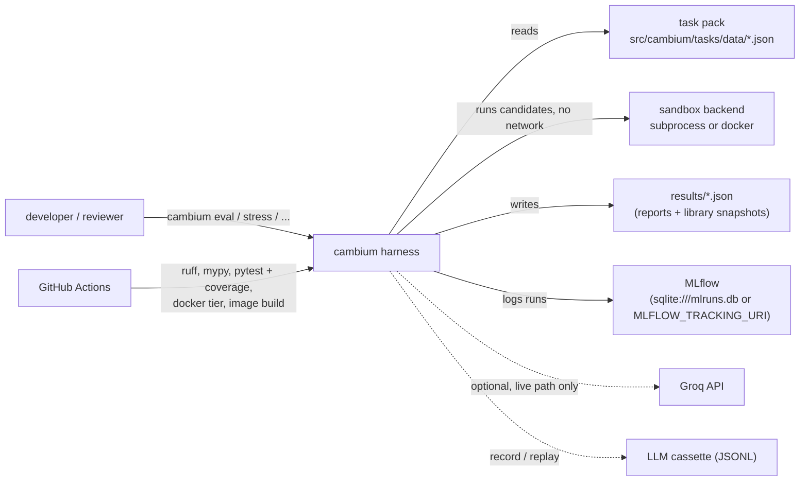
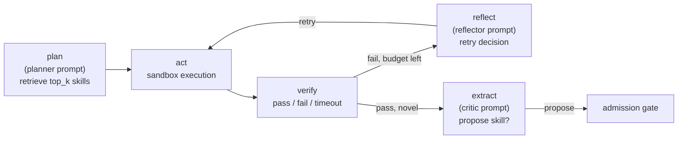
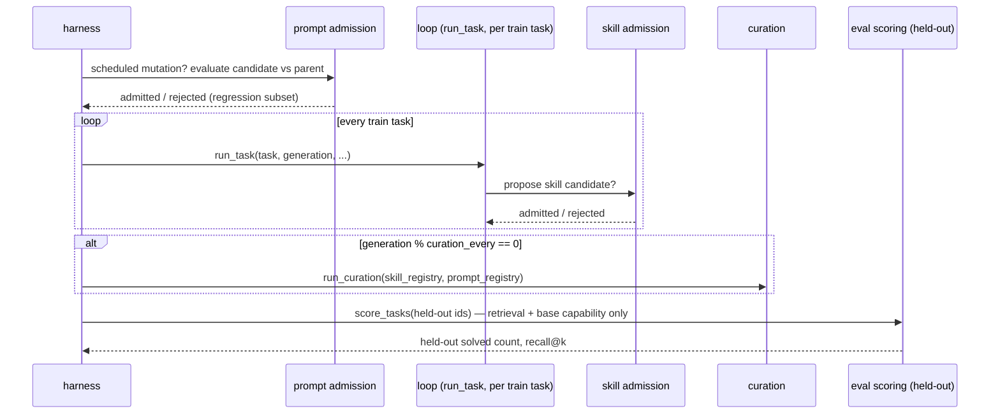

# High-Level Design

Companion to the [README](../README.md) (what/why/results) and the
[ADRs](adr/) (why each decision, individually). This document is the
system-level view: components, data flow, and the non-functional
constraints that shaped them. See [LLD.md](LLD.md) for module-level detail
— schemas, algorithms, thresholds.

---

## 1. Purpose

cambium is an agent that writes, verifies, and curates its own **skill
(tool) library** and **prompt library** across generations of task
attempts, and measures — with a held-out test set, not anecdote — whether
that library actually helps. The full thesis and scope are in
[`CLAUDE.md`](../CLAUDE.md); this document assumes that context and
describes the system built to test it.

**In scope:** the admission gate, retrieval, curation, and evaluation
around both artifact types (skills and prompts). **Fixed, not evolved:**
the control-loop architecture itself — five nodes, one sequence, never
mutated. **Out of scope:** weight updates, open-ended task domains,
coupling to any external memory system.

---

## 2. System context

There is no running service. cambium is a research harness invoked from
the command line (`cambium ...`, or the `scripts/` wrappers), against a
local, versioned filesystem: no clients, no network dependency for its
core loop (the sandbox denies network access to candidate code), no
persistent server process.

The one external network dependency is optional and isolated: the live-LLM
path (`cambium.agent.llm_client`) calls the Groq API only when explicitly
invoked (`cambium llm-demo`, `cambium eval --agent llm`). Every live
exchange can be recorded to a cassette and replayed offline
([ADR 0012](adr/0012-llm-record-replay.md)); the reported scripted curves
never touch the network ([ADR 0007](adr/0007-live-llm-integration.md)).

---

## 3. Component architecture

| Component | Package | Responsibility |
|---|---|---|
| Task pack | `cambium.tasks` | Loads the versioned task set, enforces the train/held-out split invariant |
| Sandbox | `cambium.sandbox` | Executes candidate source in a pluggable backend (subprocess or Docker); the parent judges results; optional verdict cache |
| Library store | `cambium.library` | Atomic, versioned, tamper-checked JSON snapshots of both registries |
| Skill library | `cambium.skills` | Schema, versioned registry, admission gate |
| Prompt library | `cambium.prompts` | Schema (versioned per loop node), registry, admission gate |
| Retrieval | `cambium.retrieval` | Keyword-overlap skill search + recall@k instrumentation |
| Curation | `cambium.curation` | Dedup, usage-decay deprecation, size cap, prompt version archiving |
| Agent | `cambium.agent` | Base capabilities, scripted + live generation, the fixed control loop |
| Eval | `cambium.eval` | Eval-only scoring, the three curves + attribution ablation, hacking audit, curation stress test, MLflow lineage |
| CLI | `cambium.cli` | `cambium eval / baseline / stress / llm-demo / tasks / library` |

Every package's own module docstring cites the `CLAUDE.md` section or ADR
that motivates it — that's the first place to look when a design choice
needs justifying, not this document.

### 3.1 The control loop

Fixed by [ADR 0001](adr/0001-base-loop-choice.md); node sequence never
varies. Three nodes carry an **active prompt** (versioned independently
per node); two are mechanical.

What evolves: which skill the `plan` step can retrieve (the skill
library), and the content of the `planner`/`reflector`/`critic` prompts.
What never evolves: this graph.

### 3.2 Two solving paths, same loop shape

`cambium.agent.loop.run_task` (scripted) and `run_task_llm` (live, [ADR
0007](adr/0007-live-llm-integration.md)) implement the identical node
sequence and identical admission-gate mechanics. They differ only in what
fills the generation fallback and the critic's propose-or-not decision:
a fixed candidate bank for `run_task`, a real Groq call for
`run_task_llm`. Nothing upstream (retrieval, base capability) or
downstream (the admission gate itself) knows or cares which one ran.

---

## 4. Data flow: one task attempt

1. **Plan.** The active planner prompt's `top_k` parametrizes a
   `RetrievalIndex` query against the skill registry.
2. **Act.** Each retrieved skill, then the base-capability fallback (if
   any), runs in the sandbox against the task's cases.
3. **Verify.** Sandbox result: pass, sandbox-fail, or timeout.
4. **Reflect** (only on failure with no skill/base-capability match). The
   active reflector prompt's `max_attempts` bounds how many fresh
   generation attempts get tried before giving up.
5. **Extract** (only on a novel success). The active critic prompt gates
   whether the winning source gets proposed to the admission gate at all.
6. **Admission gate** (if proposed) — see §5 — is the only path into the
   skill registry. Nothing enters by virtue of having solved a task.

## 5. Data flow: one generation of evolution

`cambium.eval.harness.run_evolution` drives this; it's the shape every
eval curve and ablation arm runs through:

Held-out tasks are **never** touched by admission decisions (train-only,
[ADR 0003](adr/0003-scaled-demo.md)) and are scored through a narrower
path than the training loop uses — no generation fallback — specifically
so the held-out curve measures what the *library* can do, not what fresh
generation can do regardless of any library
([ADR 0005](adr/0005-eval-only-scoring.md)).

---

## 6. Key design decisions

| Decision | ADR |
|---|---|
| Fixed 5-node control loop; only prompts/tools evolve | [0001](adr/0001-base-loop-choice.md) |
| Scripted stand-in for the LLM-backed agent (default for reported curves) | [0002](adr/0002-agent-stand-in.md) |
| Original 27-task pack (superseded in scale by 0010) | [0003](adr/0003-scaled-demo.md) |
| Subprocess isolation as the minimum sandbox tier | [0004](adr/0004-sandbox-tier.md) |
| Node-specific evaluation path for prompt admission | [0005](adr/0005-eval-only-scoring.md) |
| Sprint 6 scope wrap-up: what shipped, what didn't | [0006](adr/0006-sprint-6-wrapup.md) |
| Live Groq LLM wired through the ADR 0002 seam | [0007](adr/0007-live-llm-integration.md) |
| Sandbox hardening: parent-side judging, audit hook, rlimits | [0008](adr/0008-sandbox-hardening.md) |
| Container (Docker) sandbox tier behind a pluggable backend | [0009](adr/0009-container-sandbox.md) |
| Task pack at spec size: 60 tasks, 40 train / 20 held-out | [0010](adr/0010-full-task-pack.md) |
| Curation stress test; coverage-aware curation | [0011](adr/0011-curation-stress-test.md) |
| Record/replay for live-LLM runs; the harness on the LLM agent | [0012](adr/0012-llm-record-replay.md) |
| v1.0 wrap-up | [0013](adr/0013-v1-wrapup.md) |

---

## 7. Non-functional requirements

| Requirement | How it's met |
|---|---|
| **Candidate code can't fake a pass** | The child never receives expected outputs; it reports JSON return values and the parent compares with strict equality ([ADR 0008](adr/0008-sandbox-hardening.md)) |
| **No network / processes / stray writes from candidate code** | PEP 578 audit hook in the child (both tiers); Docker tier adds `--network none`, read-only root, `--cap-drop ALL`, `--pids-limit` ([ADR 0009](adr/0009-container-sandbox.md)) |
| **Resource caps** | Wall-clock timeout everywhere; `setrlimit` memory/CPU/file-size on POSIX; cgroup memory/CPU on the Docker tier |
| **Fail closed** | An unknown or unusable sandbox backend raises `SandboxBackendError`; it never downgrades silently |
| **Determinism / reproducibility** | Scripted agent for reported curves; `cambium eval` reproduces `results/eval_report.json` byte for byte; live runs recorded to replayable cassettes |
| **Auditability** | Curation archives, never deletes, and records a reason; library snapshots keep full version history; skill sources are fingerprinted and checked on load |
| **No held-out leakage into training decisions** | Every admission reuse check and regression subset is train-only ([ADR 0003](adr/0003-scaled-demo.md), enforced by tests) |
| **Lineage** | MLflow: one parent run per evolution, one nested run per generation, metrics + a reloadable library snapshot per generation |
| **Bounded library** | Coverage-aware curation keeps the active library under its cap across 25 generations of noisy proposals ([ADR 0011](adr/0011-curation-stress-test.md)) |
| **CI verification** | ruff, mypy, pytest on 3.13/3.14 with an 88% coverage gate, the sandbox suite on the Docker tier, pip-install and Docker-image smoke tests |

---

## 8. Deployment / runtime model

Nothing is deployed. The unit of execution is a CLI command:

- `cambium eval`: the three curves, ablation, hacking audit, lineage (`--agent llm` for the live model).
- `cambium stress`: the 25-generation curation stress test.
- `cambium baseline`, `cambium tasks`, `cambium library show|diff`, `cambium llm-demo`.
- `python scripts/demo.py`: everything, in order.
- `docker build -t cambium . && docker run --rm cambium eval --no-mlflow`: the same, in a pinned environment.
- `pytest -n auto`: the full suite, no network, no API key required.

MLflow lineage writes to a local SQLite file by default (`mlruns.db`,
gitignored), or wherever `--tracking-uri` / `MLFLOW_TRACKING_URI` points.
This is a research artifact, not a service.

---

## 9. Known limitations

Full accounting in [ADR 0013](adr/0013-v1-wrapup.md). The headline ones:
the reported curves are still driven by the scripted stand-in. The live
LLM curve is one `cambium eval --agent llm --llm-mode record` away but
has not been run, because the build environment had no API key. 20
held-out tasks is the spec's size but still small-n. The curation stress
test's noise is *correct* code, so it shows retrieval degradation from
ungated growth but not solve-rate degradation. And the subprocess tier's
audit hook is a CPython-level control; use the Docker tier for untrusted
code. Each limitation carries a docstring pointing back to its ADR at the
point in the code where it matters.
