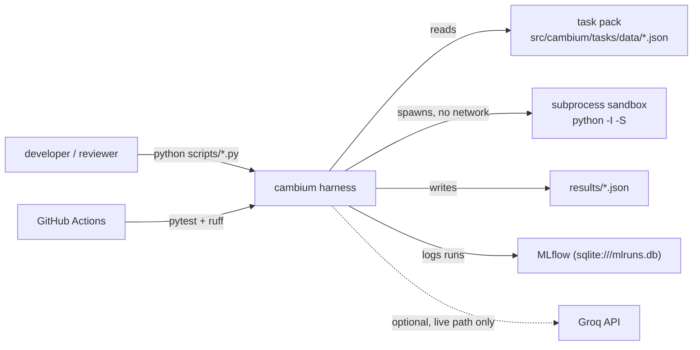
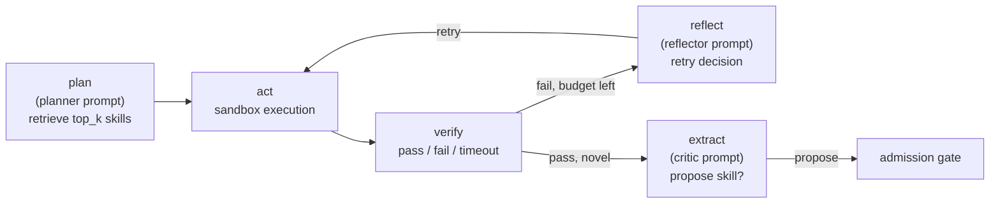
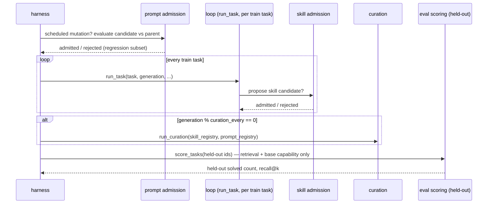

# High-Level Design

Companion to the [README](../README.md) (what/why/results) and the
[ADRs](adr/) (why each decision, individually). This document is the
system-level view: components, data flow, and the non-functional
constraints that shaped them. See [LLD.md](LLD.md) for module-level detail
— schemas, algorithms, thresholds.

---

## 1. Purpose

cambium is an agent that writes, verifies, and curates its own **skill
(tool) library** and **prompt library** across generations of task
attempts, and measures — with a held-out test set, not anecdote — whether
that library actually helps. The full thesis and scope are in
[`CLAUDE.md`](../CLAUDE.md); this document assumes that context and
describes the system built to test it.

**In scope:** the admission gate, retrieval, curation, and evaluation
around both artifact types (skills and prompts). **Fixed, not evolved:**
the control-loop architecture itself — five nodes, one sequence, never
mutated. **Out of scope:** weight updates, open-ended task domains,
coupling to any external memory system.

---

## 2. System context

There is no running service. cambium is a research harness invoked from
the command line, against a local, versioned filesystem — no clients, no
network dependency for its core loop (the sandbox explicitly denies
network access to candidate code), no persistent server process.

The one external network dependency is optional and isolated: the live-LLM
path (`cambium.agent.llm_client`) calls the Groq API when explicitly
invoked (`scripts/run_llm_demo.py`); the reproducible eval curves never
do (see [ADR 0007](adr/0007-live-llm-integration.md)).

---

## 3. Component architecture

| Component | Package | Responsibility |
|---|---|---|
| Task pack | `cambium.tasks` | Loads the versioned task set, enforces the train/held-out split invariant |
| Sandbox | `cambium.sandbox` | Executes arbitrary candidate source against fixed test cases, isolated |
| Skill library | `cambium.skills` | Schema, versioned registry, admission gate |
| Prompt library | `cambium.prompts` | Schema (versioned per loop node), registry, admission gate |
| Retrieval | `cambium.retrieval` | Keyword-overlap skill search + recall@k instrumentation |
| Curation | `cambium.curation` | Dedup, usage-decay deprecation, size cap, prompt version archiving |
| Agent | `cambium.agent` | Base capabilities, scripted + live generation, the fixed control loop |
| Eval | `cambium.eval` | Eval-only scoring, the three curves + attribution ablation, hacking audit, MLflow lineage |

Every package's own module docstring cites the `CLAUDE.md` section or ADR
that motivates it — that's the first place to look when a design choice
needs justifying, not this document.

### 3.1 The control loop

Fixed by [ADR 0001](adr/0001-base-loop-choice.md); node sequence never
varies. Three nodes carry an **active prompt** (versioned independently
per node); two are mechanical.

What evolves: which skill the `plan` step can retrieve (the skill
library), and the content of the `planner`/`reflector`/`critic` prompts.
What never evolves: this graph.

### 3.2 Two solving paths, same loop shape

`cambium.agent.loop.run_task` (scripted) and `run_task_llm` (live, [ADR
0007](adr/0007-live-llm-integration.md)) implement the identical node
sequence and identical admission-gate mechanics. They differ only in what
fills the generation fallback and the critic's propose-or-not decision:
a fixed candidate bank for `run_task`, a real Groq call for
`run_task_llm`. Nothing upstream (retrieval, base capability) or
downstream (the admission gate itself) knows or cares which one ran.

---

## 4. Data flow: one task attempt

1. **Plan.** The active planner prompt's `top_k` parametrizes a
   `RetrievalIndex` query against the skill registry.
2. **Act.** Each retrieved skill, then the base-capability fallback (if
   any), runs in the sandbox against the task's cases.
3. **Verify.** Sandbox result: pass, sandbox-fail, or timeout.
4. **Reflect** (only on failure with no skill/base-capability match). The
   active reflector prompt's `max_attempts` bounds how many fresh
   generation attempts get tried before giving up.
5. **Extract** (only on a novel success). The active critic prompt gates
   whether the winning source gets proposed to the admission gate at all.
6. **Admission gate** (if proposed) — see §5 — is the only path into the
   skill registry. Nothing enters by virtue of having solved a task.

## 5. Data flow: one generation of evolution

`cambium.eval.harness.run_evolution` drives this; it's the shape every
eval curve and ablation arm runs through:

Held-out tasks are **never** touched by admission decisions (train-only,
[ADR 0003](adr/0003-scaled-demo.md)) and are scored through a narrower
path than the training loop uses — no generation fallback — specifically
so the held-out curve measures what the *library* can do, not what fresh
generation can do regardless of any library
([ADR 0005](adr/0005-eval-only-scoring.md)).

---

## 6. Key design decisions

| Decision | ADR |
|---|---|
| Fixed 5-node control loop; only prompts/tools evolve | [0001](adr/0001-base-loop-choice.md) |
| Scripted stand-in for the LLM-backed agent (this session's default) | [0002](adr/0002-agent-stand-in.md) |
| 27-task pack (18 train / 9 held-out), scaled from the ~60-task spec | [0003](adr/0003-scaled-demo.md) |
| Subprocess isolation as the sandbox tier | [0004](adr/0004-sandbox-tier.md) |
| Node-specific evaluation path for prompt admission | [0005](adr/0005-eval-only-scoring.md) |
| Sprint 6 scope wrap-up: what shipped, what didn't | [0006](adr/0006-sprint-6-wrapup.md) |
| Live Groq LLM wired through the ADR 0002 seam, kept out of reported curves | [0007](adr/0007-live-llm-integration.md) |

---

## 7. Non-functional requirements

| Requirement | How it's met |
|---|---|
| **No network from candidate code** | Sandbox subprocess spawned with `env={}`, isolated Python mode (`-I -S`); see [ADR 0004](adr/0004-sandbox-tier.md) |
| **Hard execution timeout** | `subprocess.run(..., timeout=5.0)` per sandbox call, no exceptions |
| **Determinism / reproducibility of reported results** | Scripted generation stand-in, no live model in the eval path; seeded, fixed task pack, fixed mutation schedule |
| **Auditability** | Curation deprecates, never deletes — every skill/prompt version stays in the registry's history, `deprecated=True` only |
| **No held-out leakage into training decisions** | Every admission-gate reuse check and regression subset is asserted train-only at the call site ([ADR 0003](adr/0003-scaled-demo.md)) |
| **Lineage** | MLflow (`cambium.eval.lineage`) — one parent run per evolution, one nested child run per generation, metrics + a JSON library snapshot logged at each |
| **CI verification** | GitHub Actions runs `ruff check .` and `pytest` on every push/PR |

---

## 8. Deployment / runtime model

Nothing is deployed. The unit of execution is a Python script run locally:

- `scripts/demo.py` — the single "reproduce everything" entry point (baseline → generation demo → recall demo → curation demo → full eval harness).
- `scripts/run_llm_demo.py` — the separate live-model path, requires `GROQ_API_KEY`.
- `python -m pytest` — 82 tests, no network, no API key required.

MLflow lineage writes to a local SQLite file (`mlruns.db`, gitignored);
`mlflow ui --backend-store-uri sqlite:///mlruns.db` browses it. There is no
tracking server, no container orchestration, no CI deployment step beyond
lint + test — this is a research artifact, not a service.

---

## 9. Known limitations

Full accounting in [ADR 0006](adr/0006-sprint-6-wrapup.md). The headline
ones: 27 tasks rather than the spec's ~60; a scripted stand-in still
drives the reported curves even though a live path now exists in parallel
([ADR 0007](adr/0007-live-llm-integration.md)); curation has never been
exercised under real growth pressure past generation 3, since the task
pack is fully solved by then; subprocess rather than container sandboxing.
None of these are hidden — each carries a docstring pointing back to its
ADR at the point in the code where it matters.
